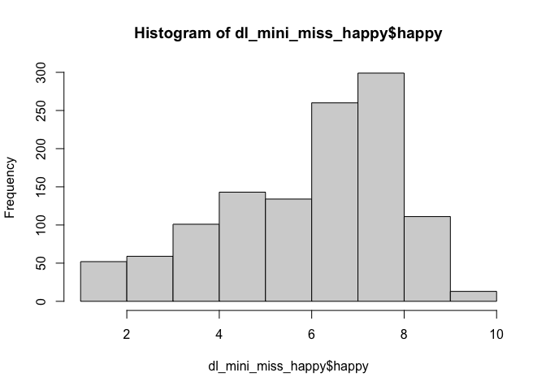
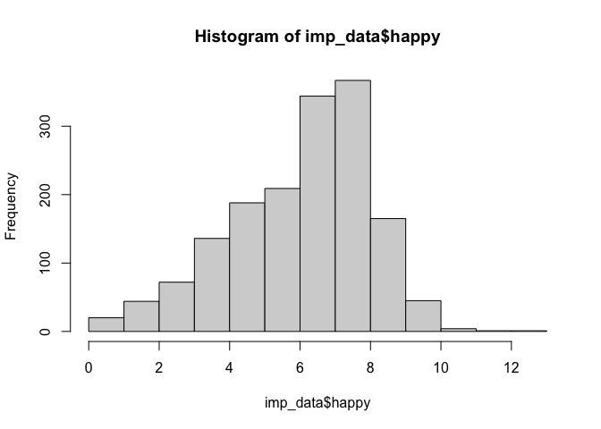

211028 MI Happy
================
Anne Margit

``` r
library(lcmm)
```

    ## Loading required package: survival

    ## Loading required package: parallel

    ## Loading required package: mvtnorm

``` r
library(dplyr)
```

    ## 
    ## Attaching package: 'dplyr'

    ## The following objects are masked from 'package:stats':
    ## 
    ##     filter, lag

    ## The following objects are masked from 'package:base':
    ## 
    ##     intersect, setdiff, setequal, union

``` r
library(survival)
library(parallel)
library(mice)
```

    ## 
    ## Attaching package: 'mice'

    ## The following objects are masked from 'package:base':
    ## 
    ##     cbind, rbind

``` r
library(tidyr)
library(skimr)
library(miceadds)
```

    ## * miceadds 3.11-6 (2021-01-21 11:48:47)

``` r
load("dl_mini_miss_happy.Rdata")
```

Impute happy only

``` r
imp <- mice(dl_mini_miss_happy, maxit=0)
```

    ## Warning: Number of logged events: 4

``` r
pred <- imp$pred
pred[,"id"] <- -2
pred[,"happy"] <- 2
pred[,c(2:36)] <- 0
pred[,c(38:59)] <- 0

imp1 <- mice(dl_mini_miss_happy, m=5, maxit=10,  meth = "2l.lmer", pred = pred, print = FALSE)

imp_data <- complete(imp1)

summary(dl_mini_miss_happy$happy)
```

    ##    Min. 1st Qu.  Median    Mean 3rd Qu.    Max.    NA's 
    ##   1.000   5.000   7.000   6.423   8.000  10.000     424

``` r
summary(imp_data$happy)
```

    ##    Min. 1st Qu.  Median    Mean 3rd Qu.    Max. 
    ##  0.5824  5.0000  7.0000  6.3911  8.0000 12.0304

``` r
hist(dl_mini_miss_happy$happy)
```

<!-- -->

``` r
hist(imp_data$happy)
```

<!-- -->
